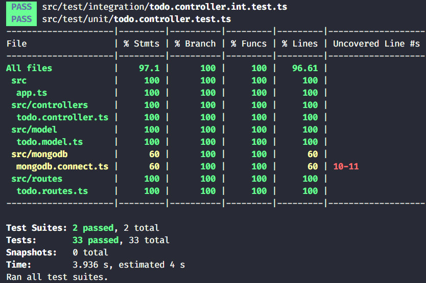

# Todo TDD 👷🏼

Todo List app backend built to practice TDD API techniques.


## Technologies ⌨️

Typescript, Node.js, Express, MongoDB.

## How to run 🧪

1. Git clone

```
git clone https://github.com/carloseustaquio/todo-tdd.git
cd todo-tdd
```

2. Build and Run

- Yarn:

```
yarn
yarn build
yarn start
```

- NPM:

```
npm install
npm run build
npm start
```
